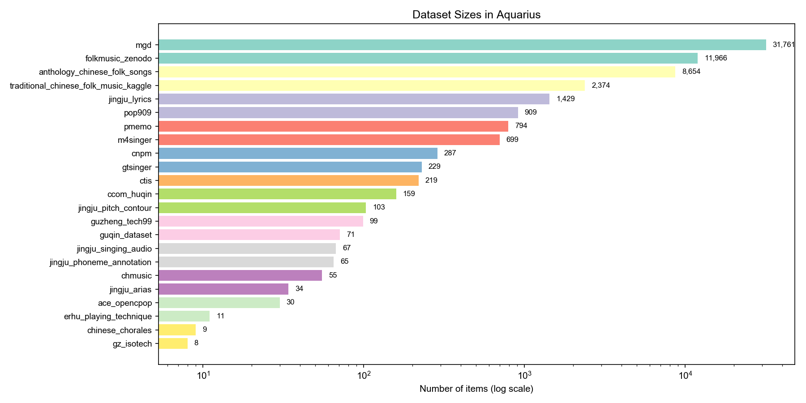
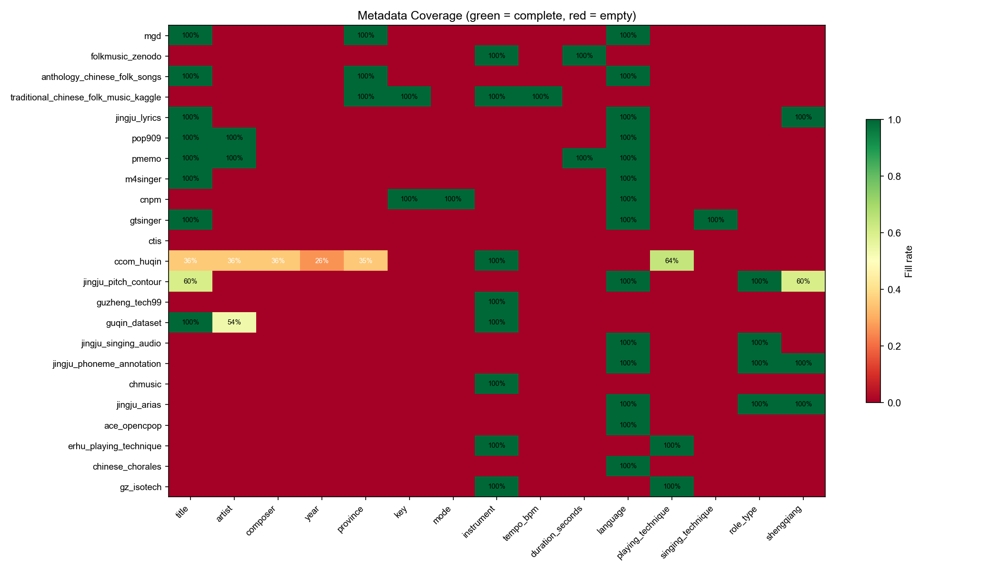
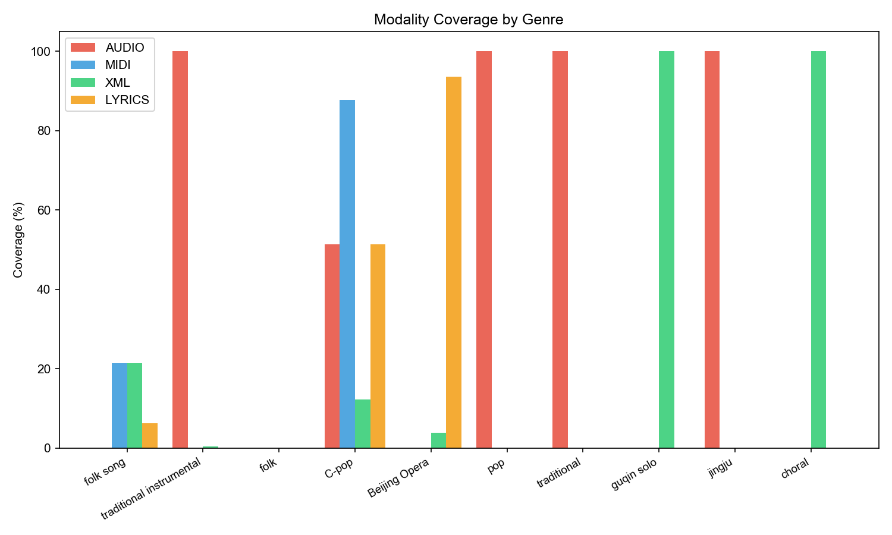
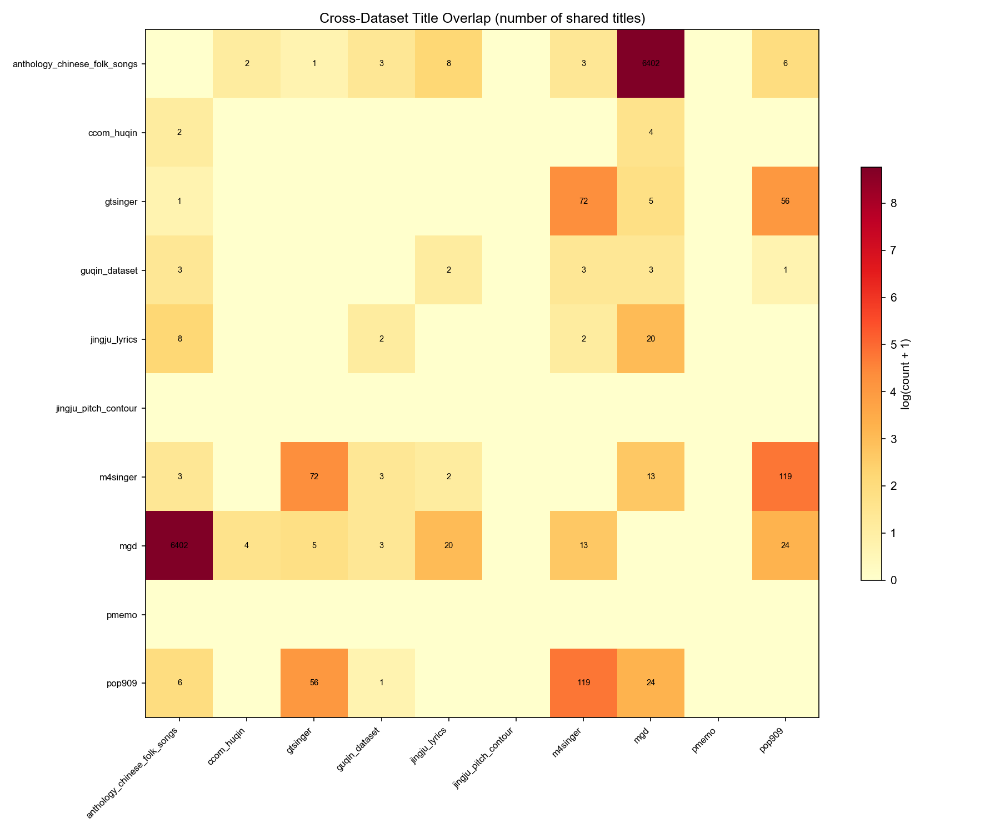
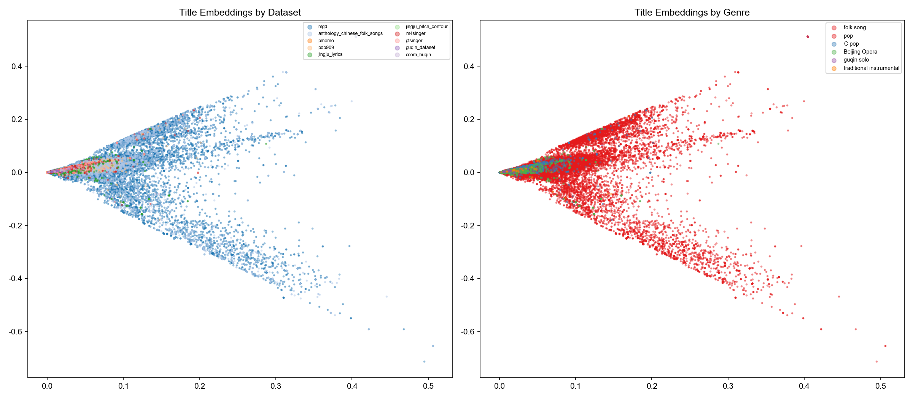
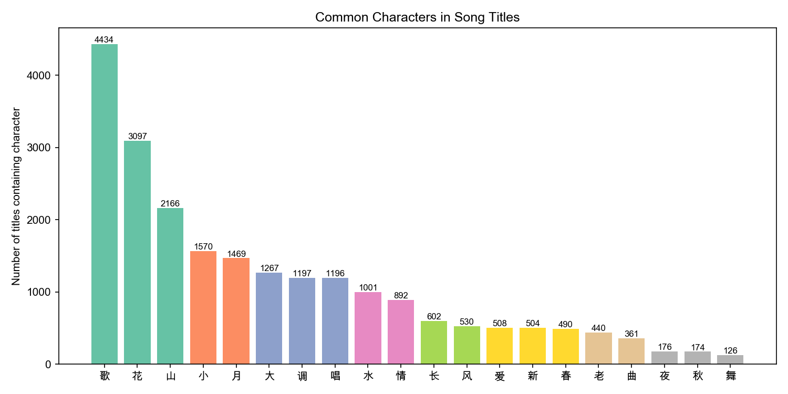
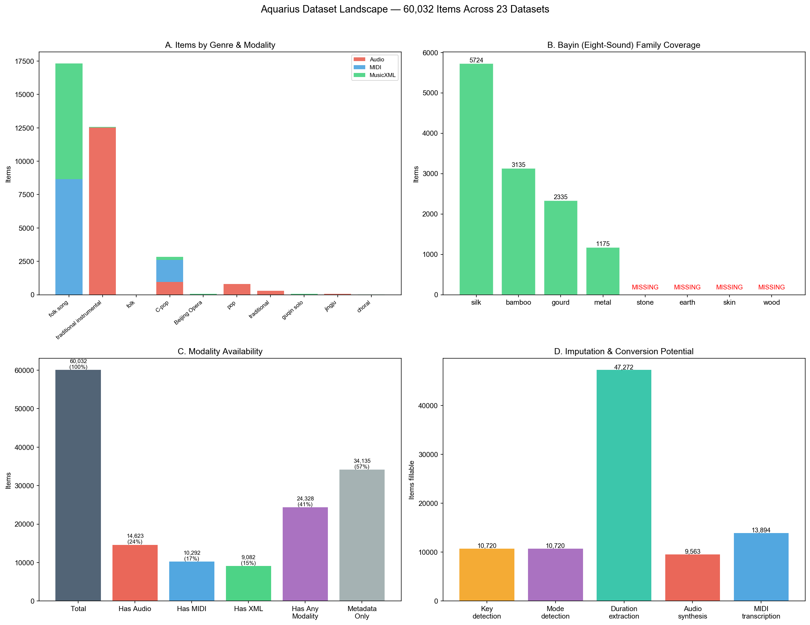
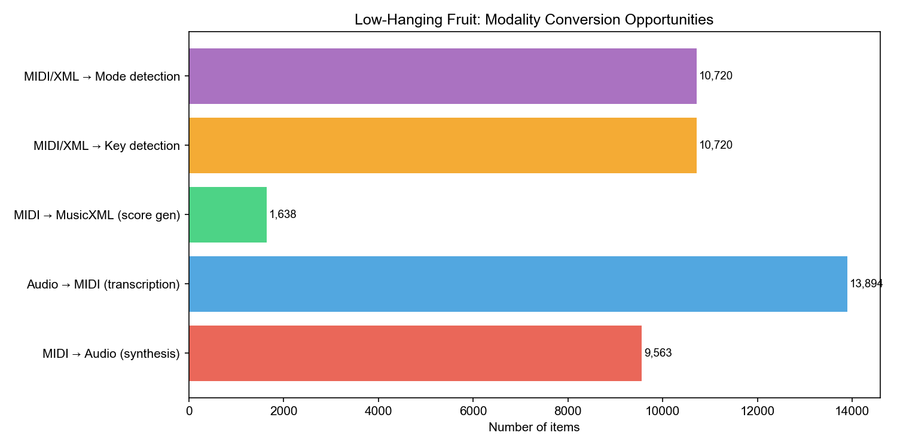

# Aquarius EDA: What 60,000 Items of Chinese Music Actually Look Like

## Approach

The analysis operates on `master_table.parquet`, a unified table of 60,032 items produced by 23 dataset-specific loaders. All analysis is metadata-level — we examine the structure, coverage, and overlap of the unified table rather than the audio or symbolic content itself. Content-level analysis (pitch distributions, spectral features, MIDI quality) is deferred to future work.

Three analysis passes were run:

1. **Overview** (`01_overview.py`): dataset composition, modality coverage, genre/instrument/province distributions, metadata sparsity.
2. **Deep analysis** (`02_deep_analysis.py`): cross-dataset title matching, duplicate ID detection, TF-IDF character n-gram embeddings (5,000 features, 1–3 character range) with TruncatedSVD projection to 50 dimensions, KMeans clustering (K=15, chosen heuristically), and statistical anomaly detection.
3. **Gap analysis** (`03_gaps_and_opportunities.py`): modality conversion opportunities, metadata imputation potential, missing traditions.

Tools: pandas, scikit-learn, matplotlib. All figures are in `notebooks/figures/`.

## The Big Picture

Aquarius pulls together 23 datasets into a single table of 60,032 items spanning folk songs, traditional instrumental music, C-pop, Beijing Opera, and a handful of smaller traditions. On paper, that sounds like a lot. In practice, the picture is more complicated — and more interesting — than raw numbers suggest.

An important caveat upfront: this is not a table of 60,032 songs. The items vary in granularity — 47,359 are full songs, 12,593 are short clips (e.g., a 3-second guzheng technique sample), 50 are phrase-level segments, and 30 are collection-level entries. These are fundamentally different units of analysis, and the raw count overstates the breadth of song-level coverage.

The dataset is dominated by two collections: MGD (31,761 folk song metadata entries) and FolkMusic/Zenodo (11,966 instrument clips). Together they account for 73% of everything. The remaining 21 datasets split the other 16,000 items across a wide range of genres and formats (Figure 1).

*Figure 1: Dataset sizes on a log scale. MGD dwarfs everything else, but it's metadata-only — no audio, no scores.*

This creates a strange asymmetry: the biggest chunk of the database has no actual music data attached to it. 57% of all items (34,135) are metadata-only, with no audio, MIDI, or score files. The items that do have music data tend to be small, specialized collections.

## The Modality Problem

The metadata sparsity heatmap (Figure 6) tells the real story. Each row is a dataset, each column is a metadata field, and the color shows how complete it is. The sea of red is striking.

*Figure 6: Metadata coverage across datasets. Green cells are fully populated, red cells are completely empty. Most of the table is red.*

A few things jump out:

- **Title** is well-covered (74%) but everything else drops off fast: artist (3%), key (4%), mode (0.5%), year (0.1%).
- **Province** looks great at 71%, but that's almost entirely MGD contributing its geographic labels.
- **Instrument** is at 25%, boosted by FolkMusic/Zenodo's 11,966 labeled clips.
- **Temporal data is nearly absent.** Only 41 items in the entire database have a year attached (all from CCOM-HuQin, ranging 1917–2017). We know roughly *nothing* about when 99.9% of these pieces were composed or recorded.
- **CCOM-HuQin** is the only dataset with meaningful coverage across multiple metadata fields — title, artist, composer, year, province, key, instrument, playing technique. It only has 159 items, but it's the richest per-item.

The genre-by-modality breakdown (Figure 8) reveals a structural gap: **folk songs have MIDI but no audio, while instrumental recordings have audio but no MIDI.** Almost no genre has both modalities covered.

*Figure 8: Modality coverage by genre. Folk songs are rich in symbolic data; instrumental music is rich in audio. Barely any overlap.*

## The Anthology–MGD Overlap

The single most important finding is the massive overlap between two folk song collections. The Anthology of Chinese Folk Songs and the MGD dataset share **6,402 song titles** — that's 74% of Anthology's 8,654 items appearing in MGD's 31,761. The title overlap matrix (Figure 7) makes this dominance visually obvious: the Anthology–MGD cell dwarfs every other pairwise overlap.

*Figure 7: Pairwise title overlap between datasets. The Anthology–MGD overlap (6,402 titles) dominates all other pairs by orders of magnitude.*

But they aren't duplicates in the traditional sense. They're complementary:

- **Anthology** has the music: all 8,654 items have both MIDI files and MusicXML scores.
- **MGD** has the metadata: province, location, and (in some cases) genre sub-type labels.

Right now they sit as separate entries in the table. Merging them would instantly create ~6,400 richly annotated folk songs with both symbolic music data *and* geographic metadata. That's arguably the single highest-impact operation we can do.

There's a catch, though. When we checked province agreement on shared titles, **56 out of 500 sampled pairs disagreed on province** (11.2%, 95% CI roughly 8.5–14.2%). The 500 were drawn from a set intersection with arbitrary ordering, not a true random sample, so this estimate carries some additional uncertainty. Folk song titles are often generic — "Mountain Song," "Work Song," "Love Song" — so title-only matching will produce false positives. Any merge pipeline needs to cross-validate on province at minimum, and ideally on melodic similarity as well.

## Title Embeddings: The Shape of Chinese Music

We embedded up to 30,000 titled items (sampled from the full titled set when it exceeds 30,000 rows) using character n-gram TF-IDF (unigrams through trigrams, 5,000 features) and projected them to 2D via TruncatedSVD (Figure 10). The character n-gram approach works well for Chinese text because it bypasses the need for word segmentation — each character and short character sequence is a feature. The two SVD components capture only a fraction of the total variance, so fine structure should be interpreted cautiously.

*Figure 10: Title embeddings colored by dataset (left) and genre (right). Folk songs form a broad cloud; PMEmo's English titles cluster tightly in a separate region.*

The left panel shows MGD and Anthology heavily overlapping — confirming the title-matching analysis. PMEmo's English-language pop songs form a tight, completely separate cluster. They're literally in a different language, and the character n-gram representation picks that up immediately.

We applied KMeans clustering with K=15 (chosen heuristically; we did not perform a formal model selection via silhouette score or elbow method). Despite this, the resulting clusters show thematically coherent groupings:

- **Cluster 0**: Love songs (妹/哥/心/情 — "sister/brother/heart/feeling")
- **Cluster 2**: Work songs about tamping/pounding (夯/打/号子 — construction chants)
- **Cluster 3**: "Flying a Kite" songs (放风筝 — a common folk theme across provinces)
- **Cluster 5**: English pop titles (the PMEmo outlier)
- **Cluster 7**: Embroidery songs (绣荷包 — "embroidered pouch," a classic folk theme)
- **Cluster 8**: Peddler songs (卖 — "selling" things)
- **Cluster 13**: Work chants/号子 (labor songs with rhythmic shouting)

The most frequent title keywords (Figure 9) confirm these patterns — terms like 山歌 (mountain song), 小调 (ditty), 花 (flower), and 号子 (work chant) dominate.

*Figure 9: Most frequent keywords in song titles, reinforcing the thematic clusters found via embedding.*

The fact that title text alone produces thematically coherent clusters suggests that Chinese folk song titles carry significant semantic information about content. Whether this extends to a useful sub-genre classifier would require a formal evaluation against labeled data.

## Instrument Coverage: Half the Bayin Is Missing

Chinese musicology traditionally classifies instruments into eight categories (八音/bayin): silk (丝), bamboo (竹), metal (金), stone (石), earth (土), skin (革), gourd (匏), and wood (木). Aquarius covers only a subset, and even the covered categories involve some judgment calls — bayin classification is not always clear-cut for modern performance contexts. Our assignments (Figure 12, Panel B):

*Figure 12: Four-panel landscape summary. Panel A: items by genre and modality. Panel B: bayin family coverage. Panel C: modality availability. Panel D: imputation and conversion potential.*

- **Silk** (strings): erhu, pipa, guzheng, zhongruan, etc.
- **Bamboo** (wind): dizi, dongxiao, hulusi
- **Gourd** (free-reed mouth organ): sheng (historically classified under 匏 for its gourd wind chamber)
- **Wood** (木): suona (traditionally 木 in bayin taxonomy, as the body is wooden despite the metal bell)

Completely absent: **stone** (lithophone/chimes), **earth** (clay ocarinas like the xun), **skin** (drums and membranophones), and **metal** (bells, gongs, cymbals). This means no percussion of any kind — a major gap for a database that aims to represent Chinese music broadly. Drum patterns are central to Beijing Opera, festival music, and ensemble performance.

## A Few Surprises

**The Kaggle key distribution is suspiciously uniform.** The 2,374 items from the Traditional Chinese Folk Music dataset on Kaggle show an almost perfectly flat distribution across six keys (D: 15.8%, A: 16.3%, F: 17.3%, E: 17.2%, C: 16.8%, G: 16.7%). By comparison, the CNPM dataset — which provides ground-truth key labels for 287 pieces — shows heavy clustering around a smaller set of tonics. The near-uniform distribution in the Kaggle data is consistent with random assignment or automated key estimation with poor calibration, rather than expert annotation.

**PMEmo is not Chinese music.** 794 items are Western pop music (English-language titles like "Stay," "Head Over Boots," "America's Sweetheart"). They're from the PMEmo emotion recognition dataset, which is listed under CSMTD but contains international popular music selected for emotion research. These should be flagged or excluded from any analysis of Chinese musical traditions. The title embedding visualization separates them cleanly.

**276 unified IDs are duplicated** in the Anthology dataset. This is a loader bug: songs that appear in both the `lyrics-included/` and `melody-only/` subdirectories get assigned the same ID. A straightforward fix, but it currently inflates the item count by about 680 rows.

**173 songs appear across the singing datasets** (M4Singer, GTSinger, POP909). These aren't duplicates — they're the *same songs performed by different singers*. Songs like「不再见」and「匆匆那年」appear in all three datasets. This is actually valuable: it enables cross-singer comparison studies, voice conversion benchmarks, and arrangement analysis. They should be cross-linked rather than deduplicated.

## The Low-Hanging Fruit

Here's what can be done without collecting new data, ranked roughly by effort-to-impact ratio:

| # | Action | Impact | 
|---|--------|--------|
| 1 | Merge Anthology ↔ MGD by title+province | ~6,400 songs get both MIDI and metadata |
| 2 | Key detection on MIDI/MusicXML items | 10,720 items get key via Krumhansl-Schmuckler |
| 3 | Pentatonic mode detection | 10,720 items get Chinese mode labels |
| 4 | Fix duplicate IDs | Anthology loader bug, 276 duplicated IDs |
| 5 | POP909 year lookup | 909 songs get release year via MusicBrainz |
| 6 | MIDI → audio synthesis | 9,563 items get synthesized audio via FluidSynth |
| 7 | Audio → MIDI transcription | 13,894 audio clips get MIDI via Basic Pitch |
| 8 | MIDI → MusicXML conversion | 1,638 items get score representation via music21 |
| 9 | Flag/exclude PMEmo | 794 non-Chinese items properly labeled |

The conversion opportunity breakdown (Figure 11) visualizes these counts per dataset.

*Figure 11: Conversion opportunities by dataset. Key/mode detection has the broadest reach; audio transcription targets the instrumental collections.*

The mode detection opportunity deserves special attention. Right now, only 287 items (from CNPM) have Chinese pentatonic mode labels (宫/商/角/徵/羽). 10,720 items have MIDI or MusicXML data from which mode could be computationally estimated. However, CNPM's 287 ground-truth examples span 5 modes × 12 tonics × 6 scale systems, which means coverage of the 360 possible mode-tonic-scale combinations is very thin — less than one example per class on average. A practical classifier would likely need to reduce the label space (e.g., predict mode only, ignoring tonic and scale system) or use a hierarchical approach. Even so, scaling pentatonic mode annotation from 287 to thousands of items would be a meaningful contribution to computational Chinese musicology.

## Redistribution and Licensing

Not all 60,032 items can be freely redistributed, which matters for a TISMIR dataset paper. Of the 23 datasets:

- **Freely redistributable**: POP909 (MIT), Kaggle Folk Music (CC0), CCOM-HuQin (CC-BY-4.0), FolkMusic/Zenodo (CC-BY-4.0), ACE/OpenCPOP (CC-BY-NC-4.0), Chinese Chorales (public domain)
- **Institutional restriction**: The CCMusic ecosystem (CTIS, GZ-IsoTech, CNPM, Erhu Playing Technique, Guzheng Tech99, Jingju datasets) is licensed CC-BY-4.0 but restricted to "the applicant and members of the applicant's department or research institution"
- **Gated or custom**: M4Singer (no redistribution), GTSinger (HuggingFace gated), PMEmo (research-only)
- **Unclear**: Guqin, Anthology, MGD, ChMusic — license terms need clarification from authors

The Aquarius unified table itself can contain metadata and pointers for all items, but direct redistribution of audio/MIDI content requires per-dataset compliance. The full license audit is in `docs/license_audit.md`.

## What's Still Missing

Beyond the bayin gaps (no percussion), several major Chinese musical traditions have no representation at all:

- **Kunqu Opera** — the "mother of Chinese opera," UNESCO Intangible Cultural Heritage, zero items
- **Cantonese Opera** — one of the three major Chinese opera forms, zero items
- **Chinese orchestra/ensemble** — all datasets contain solo instrument or solo voice recordings
- **Buddhist and Taoist ritual music** — an important scholarly field, zero items
- **Minority music beyond Xinjiang** — Tibetan, Mongolian, Dai, Miao, Yi, Bai music largely absent

The temporal dimension is almost entirely blank. Without knowing *when* music was composed or recorded, it's impossible to study historical trends, stylistic evolution, or the influence of political/cultural events on musical practice. This is the hardest gap to fill because most folk song collections simply don't record dates.

## Limitations

This analysis is metadata-level only. We examined the structure, coverage, and overlap of the unified table, but did not analyze the actual musical content — no pitch distributions, spectral features, MIDI quality checks, or audio-level statistics. A content-level analysis would strengthen several of the findings here (e.g., verifying the Kaggle key anomaly against actual audio, checking Anthology MIDI quantization quality, measuring duration distributions across genres).

The title-based deduplication relies on exact string matching after normalization (stripping Chinese quotation marks and parentheses). This misses alternate transliterations, character variants, and titles that differ only in bracketed annotations. A content-based matching approach (e.g., melodic similarity) would catch overlaps that title matching misses.

The title-cleaning regex does not handle all bracket styles (【】, 《》) or interpunct (·), which may cause false negatives in overlap counts.

The granularity heterogeneity — mixing songs, clips, segments, and collections in one table — complicates summary statistics. When we say "60,032 items," that includes 3-second technique samples alongside complete folk songs. Users of the database will need to filter by granularity for most analytical purposes.

## Conclusion

Aquarius is wide but uneven. It captures a genuine breadth of Chinese musical traditions — from 31-province folk song collections to Beijing Opera phoneme annotations to guzheng technique detection — but the depth varies wildly. The biggest quick win is merging the Anthology and MGD datasets, which would transform ~6,400 entries from partial records into richly annotated, multi-modal items. The biggest research opportunity is pentatonic mode detection at scale — moving from 287 ground-truth labels to thousands. And the biggest remaining gap is the complete absence of percussion, ensemble music, and non-Beijing opera traditions.

For the broader MIR community, Aquarius addresses a structural imbalance: most large-scale music databases (MusicNet, MAESTRO, MUSDB18) are Western-centric. A unified Chinese music database opens up research questions around pentatonic systems, heterophonic texture, regional variation across 31 provinces, and the relationship between oral tradition and written notation — questions that existing Western-oriented resources cannot support.

The 12 figures referenced throughout are in `notebooks/figures/`. The analysis code is in `notebooks/01_overview.py`, `02_deep_analysis.py`, and `03_gaps_and_opportunities.py`.

### Figure Index

| # | File | Description | Referenced in |
|---|------|-------------|---------------|
| 1 | `01_dataset_sizes.png` | Dataset sizes (log-scale bar chart) | The Big Picture |
| 2 | `02_modality_coverage.png` | Modality coverage per dataset (stacked bar) | Supplementary |
| 3 | `03_genre_pie.png` | Genre distribution (pie chart) | Supplementary |
| 4 | `04_instruments.png` | Top 25 instruments (bar chart) | Supplementary |
| 5 | `05_provinces.png` | Geographic distribution by province | Supplementary |
| 6 | `06_metadata_sparsity.png` | Metadata sparsity heatmap (dataset × field) | The Modality Problem |
| 7 | `07_title_overlap_matrix.png` | Pairwise title overlap matrix | The Anthology–MGD Overlap |
| 8 | `08_genre_modality.png` | Genre × modality grouped bars | The Modality Problem |
| 9 | `09_title_keywords.png` | Title keyword frequencies | Title Embeddings |
| 10 | `10_title_embeddings.png` | 2D title embedding scatter | Title Embeddings |
| 11 | `11_conversion_opportunities.png` | Conversion opportunity counts | Low-Hanging Fruit |
| 12 | `12_landscape_summary.png` | Four-panel landscape summary | Instrument Coverage |
